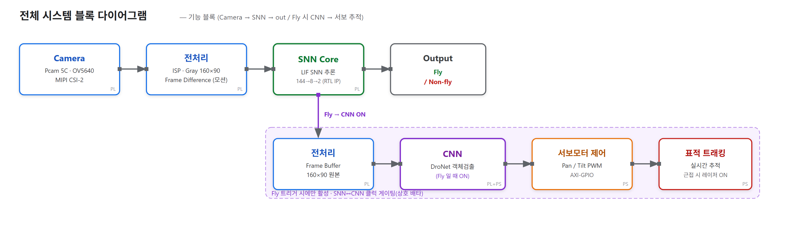
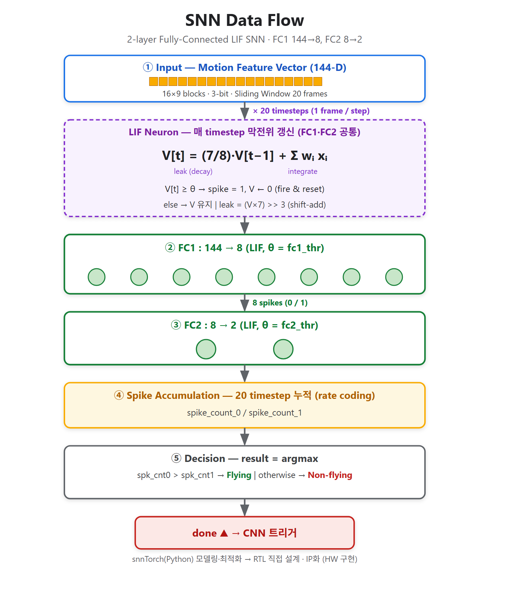
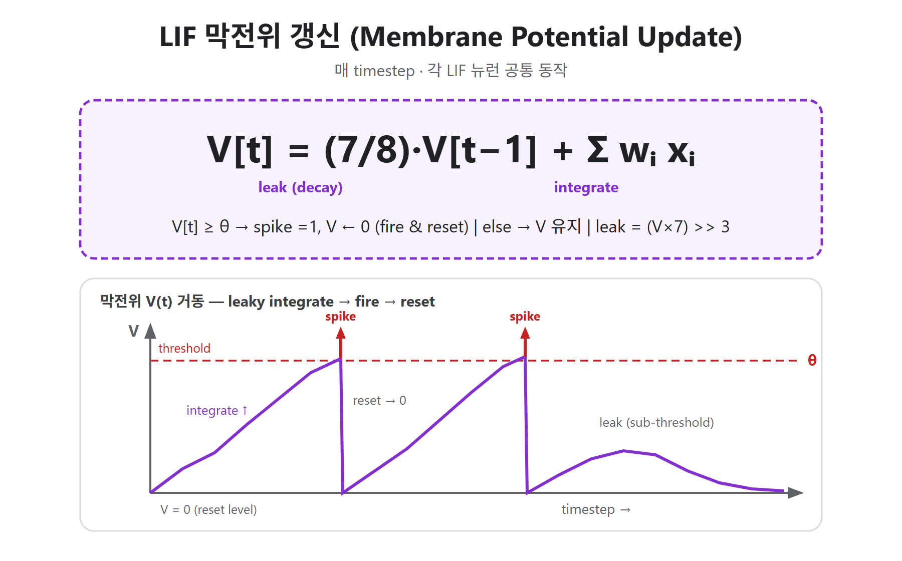
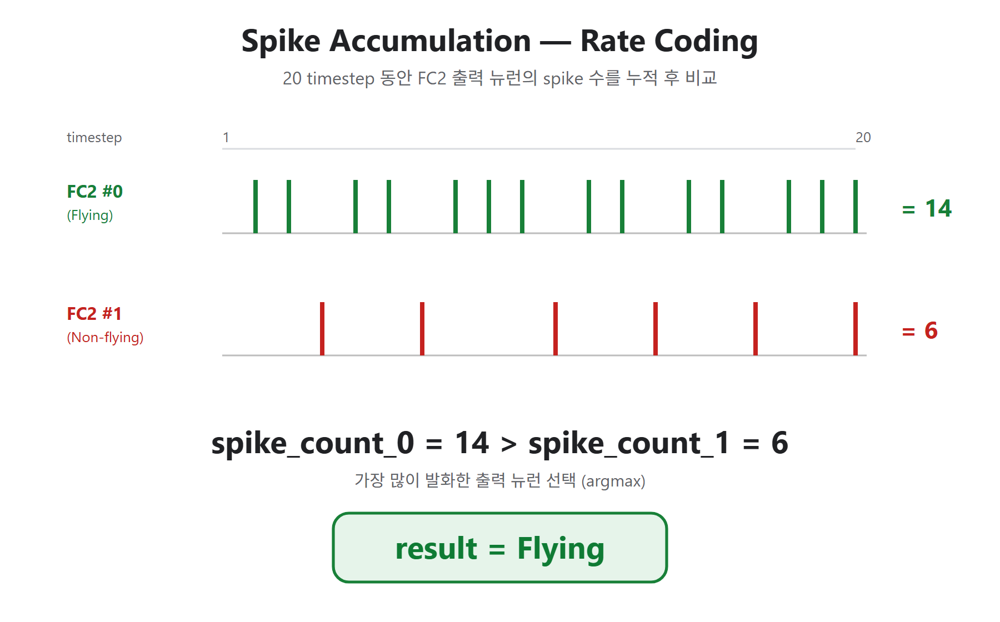

# 이벤트 기반 저전력 비행물체(드론) 탐지·추적 시스템
### SNN–CNN Cascade Anti-Drone Detection & Tracking on a Single FPGA SoC

카메라 입력부터 조준까지 **외부 GPU·서버 없이 단일 FPGA(Zybo Z7-20) 보드에서 on-board** 로 동작하는
**SNN(1차 게이팅) → CNN(정밀 탐지) → Pan-Tilt 추적** 캐스케이드 영상 인식 시스템입니다.
평시에는 저전력 **SNN**이 비행 움직임만 감시하고, 후보가 잡힐 때만 **CNN**을 클럭 게이팅으로 깨워
불필요한 연산·전력을 최소화합니다.

> 경희대학교 전자공학과 종합설계 · 류대선, 박시온, 정은택 (지도교수: 홍상훈)

---

## 시스템 개요



```
Pcam 5C ─▶ 전처리(ISP·Gray 160×90·Frame Diff) ─▶ SNN(1차 판별) ─▶ Fly / Non-fly
                                                      │ Fly 트리거
                                                      ▼
              전처리(Frame Buffer) ─▶ CNN(DroNet 정밀 탐지) ─▶ Pan-Tilt 서보 추적
              └──────────── Fly 시에만 활성 · SNN↔CNN 클럭 게이팅(상호 배타) ─────────┘
```

- **영상 입력(PL)** — Pcam 5C(OV5640) → MIPI CSI-2 → ISP(Bayer→RGB·감마) → 160×90 그레이 다운스케일 → VDMA로 현재·이전 프레임 확보 → Frame Difference IP로 모션 추출
- **SNN(PL)** — 모션을 16×9 블록의 3-bit 특징벡터(144-D)로 압축, 20프레임 슬라이딩 윈도우를 LIF SNN이 처리해 비행/비행아님 1차 판별. **RTL 직접 설계 IP화**, AXI-GPIO로 PS와 통신
- **CNN(PL+PS)** — SNN 트리거 시 DroNet 가속기가 정밀 객체 검출, PS(ARM)가 sigmoid·NMS 후처리로 바운딩 박스 산출
- **Pan-Tilt 제어(PS)** — 객체 중심 오차 → AXI-GPIO(PWM)로 팬/틸트 서보 추적, 근접 시 레이저 활성화

---

## 🎥 데모 영상

실시간 드론 탐지 · 팬틸트 추적 데모:

<video src="https://github.com/Godsion-pro/snn_cnn_CASCADE/raw/main/docs/demo.mp4" controls width="640"></video>

> ▶ 재생이 안 되면 [docs/demo.mp4](docs/demo.mp4) 에서 직접 확인하세요.

---

## 핵심 성과

| 항목 | 결과 |
|---|---|
| SNN 드론 움직임 탐지 정확도 | **98%** |
| CNN Object Detection 정확도 | **AP@0.5 = 89%** |
| 실시간 추론 속도 | **37 FPS** (지연 없는 탐지·추적) |
| SNN 추론 지연 | **≈ 236 µs** |
| 감시(평시) 전력 오버헤드 | **+12 mA** (모델 크기 무관 고정) |
| 전력 절감률 | **최대 ~42%** (CNN 단독 설계 대비, 표적 희소 환경) |
| 자원 사용량 | **LUT 52% · BRAM 65%** (단일 칩 수용) |

핵심 아이디어: **표적이 드물수록 이득이 커지는 구조** — 평시엔 SNN만 상시 구동하고, CNN은 필요할 때만
클럭을 켜서 고비용 연산을 회피합니다.

---

## SNN Core

2-layer fully-connected **LIF(Leaky Integrate-and-Fire) SNN** — `FC1(144→8) → FC2(8→2)`.
`snnTorch`(Python)로 모델링·최적화 후 **RTL로 직접 설계해 IP화**했습니다.



**막전위 갱신 (매 timestep · 각 뉴런 공통)**



```
V[t] = (7/8)·V[t−1] + Σ wᵢxᵢ        # leak(decay) + integrate
V[t] ≥ θ → spike=1, V←0 (fire & reset), else V 유지    # leak = (V×7)>>3 (shift-add)
```

**Spike Accumulation (rate coding)** — 20 timestep 동안 두 출력 뉴런의 spike 수를 누적·비교(argmax)



- 3-stage 파이프라인 **9-MAC(DSP) 트리**, 가중치 **BRAM(signed 8-bit)**
- Dual-clock: 추론(150 MHz) / 가중치·임계값 로드(100 MHz, AXI-GPIO)
- 주요 소스: [`CORE_IP/src/snn_top.v`](CORE_IP/src/snn_top.v), [`feature_extractor.v`](CORE_IP/src/feature_extractor.v), [`Top.v`](CORE_IP/src/Top.v)

---

## CNN Core

**DroNet** 기반 경량 객체 검출 가속기. RTL 이식을 위해 **INT8 양자화·정수 연산**만으로 구현.

```
Input 160×90×1
 → Conv1 3×3(1→8) → Pool → Conv2 3×3(8→16) → Pool → Conv3 3×3(16→32) → Pool
 → Conv4 1×1(32→16) → Conv5 3×3(16→32) → Det 1×1(32→6)
 → 20×11×6 (= 220 cell × 6ch: tx, ty, tw, th, obj, cls, 1320 byte raw)
```

- **8개 PE 병렬**, 3×3 conv는 3-stage 파이프라인 9-MAC(DSP) 트리
- ping-pong 프레임버퍼로 입력 캡처, 가중치·제어(start/done)는 **AXI-Lite**
- 후처리(PS): raw 1320 byte → sigmoid·exp 디코딩 → NMS → 최종 객체 위치

---

## 클럭 게이팅 (SNN ↔ CNN 상호 배타)

`snn_cnn_sel`(1-bit mode 분배) + `clk_en_gate`(BUFGCE) 로 **SNN 모드에선 CNN 코어 클럭을,
CNN 모드에선 SNN 클럭을 정지**시켜 불필요한 스위칭 전력을 제거합니다. CNN의 AXI-Lite·프레임버퍼는
항상 켜져 PS 버스가 멈추지 않도록 **연산 코어 클럭만** 게이팅합니다.

---

## 저장소 구조

```
snn_cnn_CASCADE/
├── CORE_IP/src/            # SNN 코어 RTL (snn_top, feature_extractor, Top, TB)
├── hw_new_backup/hw_new/
│   └── hw.srcs/            # Vivado 소스 (RTL·블록디자인·제약·CNN RTL·TB)   ※ 생성물(.runs/.sim/.gen/.cache)은 .gitignore 제외
├── docs/                   # 아키텍처·데이터플로우 다이어그램 (SVG/PNG) + 데모 영상
└── sim_data/               # 가중치/입력 프레임 hex (SNN·CNN weight, frames)
```

> Vivado 생성 디렉토리(`hw.runs`, `hw.sim`, `hw.gen`, `hw.cache`, `hw.ip_user_files`)는
> 용량이 커서 `.gitignore`로 제외했습니다. 프로젝트는 `hw_new_backup/hw_new/hw.xpr` 로 열어 재생성합니다.

---

## 빌드 / 재현

- **Vivado**: `hw_new_backup/hw_new/hw.xpr` 열기 → Generate Bitstream (Zybo Z7-20 / `xc7z020clg400-1`)
- **전력 측정(SAIF)**: SNN+CNN 서브블록 OOC 합성 → post-synth functional sim으로 SAIF 생성 → `report_power` 적용
- **소프트웨어(Vitis)**: PS에서 카메라·SNN/CNN 제어·팬틸트 추적 구동 (모드 전환은 GPIO `mode_sel`)

---

## 기술 스택

`FPGA / Zynq-7000 (Zybo Z7-20)` · `Verilog RTL` · `Vivado / Vitis` · `AXI-Lite / AXI-GPIO / AXI-Stream`
· `snnTorch (SNN 학습)` · `DroNet (CNN)` · `INT8 양자화` · `Clock Gating (BUFGCE)`
